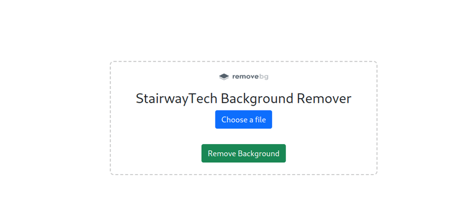
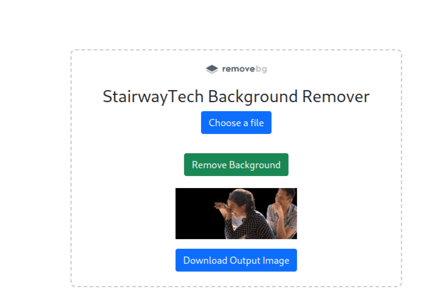

# Background Remover with Python and Quart Framework

Remove backgrounds from images using this simple web application built with Python and Quart. This project utilizes advanced image processing techniques to accurately remove backgrounds, providing users with clean and transparent images.

## Features

- **Easy to Use:** Simple web interface for uploading and processing images.
- **Fast and Efficient:** Utilizes Quart, an asynchronous web framework, for quick image processing.
- **Accurate Background Removal:** Advanced image processing algorithms ensure accurate background removal.
- **Transparent Output:** Save images with transparent backgrounds in PNG format.
- **Customizable:** Extend or modify the code according to your specific needs.

## Screenshots

### Home Page



### Image Processing


### Result



## Getting Started

Follow these steps to set up the project on your local machine:

### Prerequisites

- Python 3.7 or higher
- [Quart](https://pgjones.gitlab.io/quart/)

### Installation

1. Clone the repository:

    ```bash
    git clone https://github.com/OnpointSoftwares/Image-Background-Remover.git
    cd background-remover
    ```

2. Install dependencies:

    ```bash
    pip install -r requirements.txt
    ```

### Usage

1. Run the application:

    ```bash
    python app.py
    ```

2. Open your web browser and go to [http://127.0.0.1:5000](http://127.0.0.1:5000).

3. Upload an image, and the application will process it, removing the background.

## Contributing

If you'd like to contribute to this project, please follow the [Contributing Guidelines](CONTRIBUTING.md).

## License

This project is licensed under the MIT License - see the [LICENSE](LICENSE) file for details.

## Acknowledgments

- Thanks to the Quart team for providing a powerful asynchronous web framework.
- Special thanks to [Author Name] for their [Awesome Image Processing Library](https://github.com/example/image-processing-library) used in this project.

## Contact

For any inquiries, please contact [vincentbettoh@gmail.com].
